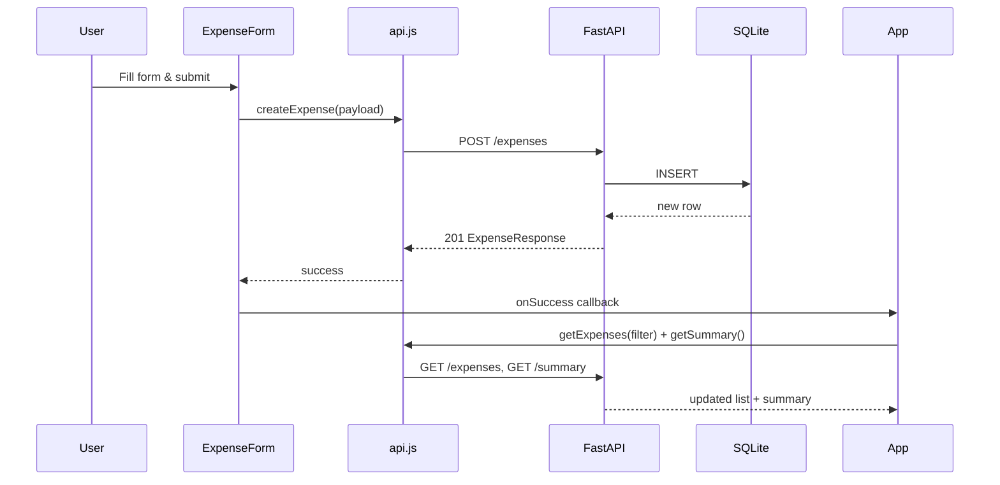
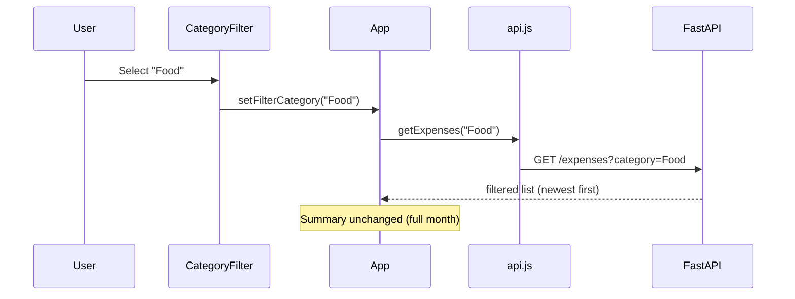

# Expense Tracker — Architecture & Implementation Plan

> **Status:** Planning document (pre-implementation)  
> **Scope:** Single-page local expense tracker with 5 fixed features  
> **Last updated:** 2026-06-12

---

## 1. Overview

This document defines the architecture, data model, API contract, frontend layout, and step-by-step implementation plan for a **localhost-only** expense tracker.

The application is intentionally minimal:

- **No authentication** — single user on a local machine
- **No deployment** — runs on `localhost` only
- **Fixed feature set** — exactly 5 capabilities (Create, Read, Delete, Summary, Filter); no scope creep

### 1.1 High-Level Architecture

```
┌─────────────────────────────────────────────────────────────┐
│                     Browser (localhost)                      │
│  ┌───────────────────────────────────────────────────────┐  │
│  │           React SPA (Vite) — single page               │  │
│  │  ┌─────────┐ ┌──────────┐ ┌─────────┐ ┌────────────┐  │  │
│  │  │  Form   │ │  Filter  │ │ Summary │ │ Expense    │  │  │
│  │  │ (Create)│ │          │ │  Panel  │ │ List+Delete│  │  │
│  │  └────┬────┘ └────┬─────┘ └────┬────┘ └─────┬──────┘  │  │
│  │       └───────────┴────────────┴─────────────┘        │  │
│  │                         │ fetch (REST)                 │  │
│  └─────────────────────────┼───────────────────────────────┘  │
└────────────────────────────┼────────────────────────────────┘
                             │ HTTP (CORS enabled)
                             ▼
┌─────────────────────────────────────────────────────────────┐
│              FastAPI Backend (localhost:8000)                │
│  ┌──────────────┐    ┌──────────────┐    ┌───────────────┐  │
│  │   Routers    │───▶│   Schemas    │───▶│  SQLite DB    │  │
│  │  /expenses   │    │  (Pydantic)  │    │  expenses.db  │  │
│  │  /summary    │    └──────────────┘    └───────────────┘  │
│  └──────────────┘                                            │
└─────────────────────────────────────────────────────────────┘
```

---

## 2. Requirements Mapping

| # | Feature | Requirement | Backend Responsibility | Frontend Responsibility |
|---|---------|-------------|------------------------|-------------------------|
| 1 | **Create** | Add expense: amount, category, note, date | `POST /expenses` — validate & persist | Form with validation; call API; refresh list & summary |
| 2 | **Read** | List expenses, **newest first** | `GET /expenses` — `ORDER BY date DESC, id DESC` | Render list; show loading/error states |
| 3 | **Delete** | Remove selected expense | `DELETE /expenses/{id}` | Delete button per row; confirm optional; refresh |
| 4 | **Summary** | Total **this month** + total **per category** | `GET /summary` — aggregate in SQL | Summary cards / breakdown table |
| 5 | **Filter** | By category: Food, Transport, Bills, Entertainment, Other | `GET /expenses?category=Food` (optional query) | Dropdown/tabs; pass category to API |

### 2.1 Fixed Categories (enum)

```
Food | Transport | Bills | Entertainment | Other
```

Categories are **closed set** — enforced on backend (Pydantic enum + DB CHECK constraint). Frontend uses the same list for the create form and filter control.

### 2.2 Assumptions & Clarifications

| Topic | Decision | Rationale |
|-------|----------|-----------|
| Frontend framework | **React + Vite** (not Next.js) | Pure SPA; no SSR/routing needed for a single page |
| Currency | Display as decimal (e.g. `$12.50`); store as `REAL` in SQLite | Simple local app; no multi-currency |
| Date field | User-selected calendar date (`YYYY-MM-DD`) | Matches requirement; no time-of-day |
| "Newest first" | Sort by `date DESC`, then `id DESC` | Same calendar date → most recently created appears first |
| "This month" | Expenses where `date` falls in the **current calendar month** (server local time) | Standard interpretation; computed server-side |
| Filter scope | Filter affects **list only**; summary always shows **full current month** (all categories) | Summary = monthly overview; filter = list UX |
| Amount validation | Must be `> 0` | Zero/negative expenses are not meaningful |
| Note field | Optional text, max ~500 chars | Required field in schema but can be empty string |
| Persistence | SQLite file `backend/expenses.db` | Zero overhead; file created on first run |

---

## 3. Technology Stack

### 3.1 Backend

| Layer | Choice | Version (target) |
|-------|--------|------------------|
| Runtime | Python | 3.11+ |
| Framework | FastAPI | latest stable |
| ASGI server | Uvicorn | latest stable |
| ORM / DB access | **Raw `sqlite3`** (stdlib) | — |
| Validation | Pydantic v2 | bundled with FastAPI |
| CORS | `fastapi.middleware.cors.CORSMiddleware` | allow `http://localhost:5173` |

**Why raw SQLite instead of SQLAlchemy?**  
Five endpoints and one table do not justify an ORM. Direct SQL keeps the backend small and easy to read.

### 3.2 Frontend

| Layer | Choice |
|-------|--------|
| Framework | React 18 |
| Build tool | Vite 6 |
| Language | JavaScript (or TypeScript if preferred later) |
| Styling | Plain CSS (single `App.css` + CSS variables) |
| HTTP client | `fetch` (native; no axios) |
| State | React `useState` + `useEffect` (no Redux/Zustand) |

**Why Vite over Next.js?**  
Next.js adds routing, SSR, and deployment patterns we explicitly do not need. Vite gives the fastest local dev experience for a single-page app.

### 3.3 Local Ports

| Service | URL |
|---------|-----|
| FastAPI | `http://localhost:8000` |
| Vite dev server | `http://localhost:5173` |
| API docs (auto) | `http://localhost:8000/docs` |

Vite `proxy` in `vite.config.js` can forward `/api` → `8000` to avoid CORS during dev (optional; CORS middleware is sufficient).

---

## 4. Data Model

### 4.1 Entity: Expense

| Column | Type | Constraints | Notes |
|--------|------|-------------|-------|
| `id` | INTEGER | PRIMARY KEY AUTOINCREMENT | Internal identifier |
| `amount` | REAL | NOT NULL, `> 0` | Stored as float; 2 decimal places in UI |
| `category` | TEXT | NOT NULL, CHECK in enum | One of 5 categories |
| `note` | TEXT | NOT NULL DEFAULT `''` | Free text |
| `date` | TEXT | NOT NULL | ISO `YYYY-MM-DD` |
| `created_at` | TEXT | NOT NULL DEFAULT `datetime('now')` | Audit / tie-break for sort |

### 4.2 DDL (SQLite)

```sql
CREATE TABLE IF NOT EXISTS expenses (
    id          INTEGER PRIMARY KEY AUTOINCREMENT,
    amount      REAL    NOT NULL CHECK (amount > 0),
    category    TEXT    NOT NULL CHECK (
        category IN ('Food', 'Transport', 'Bills', 'Entertainment', 'Other')
    ),
    note        TEXT    NOT NULL DEFAULT '',
    date        TEXT    NOT NULL,
    created_at  TEXT    NOT NULL DEFAULT (datetime('now'))
);

CREATE INDEX IF NOT EXISTS idx_expenses_date ON expenses (date DESC);
CREATE INDEX IF NOT EXISTS idx_expenses_category ON expenses (category);
```

### 4.3 Pydantic Schemas

```python
# Conceptual — not yet implemented

class Category(str, Enum):
    FOOD = "Food"
    TRANSPORT = "Transport"
    BILLS = "Bills"
    ENTERTAINMENT = "Entertainment"
    OTHER = "Other"

class ExpenseCreate(BaseModel):
    amount: float = Field(gt=0)
    category: Category
    note: str = ""
    date: date  # Python date → serialized as YYYY-MM-DD

class ExpenseResponse(ExpenseCreate):
    id: int
    created_at: datetime

class SummaryResponse(BaseModel):
    month_total: float
    by_category: dict[str, float]  # all 5 keys present, 0.0 if no expenses
```

---

## 5. API Design

Base path: `/api` (optional prefix) or root `/`. This plan uses **root paths** for simplicity.

### 5.1 Endpoints

| Method | Path | Query Params | Body | Response | Feature |
|--------|------|--------------|------|----------|---------|
| `POST` | `/expenses` | — | `ExpenseCreate` | `ExpenseResponse` (201) | Create |
| `GET` | `/expenses` | `category?` | — | `ExpenseResponse[]` | Read + Filter |
| `DELETE` | `/expenses/{id}` | — | — | 204 No Content | Delete |
| `GET` | `/summary` | — | — | `SummaryResponse` | Summary |
| `GET` | `/health` | — | — | `{ "status": "ok" }` | Dev convenience |

### 5.2 Endpoint Details

#### `POST /expenses`
- Validates body; returns `422` on invalid category or amount ≤ 0
- Inserts row; returns created expense with `id`

#### `GET /expenses`
- **No filter:** returns all expenses, `ORDER BY date DESC, id DESC`
- **With `?category=Food`:** same sort, `WHERE category = ?`
- Returns `[]` when empty

#### `DELETE /expenses/{id}`
- Deletes by primary key
- Returns `404` if id not found
- Returns `204` on success

#### `GET /summary`
- Computes for **current calendar month** using server's `date('now')`:
  ```sql
  -- month_total
  SELECT COALESCE(SUM(amount), 0) FROM expenses
  WHERE strftime('%Y-%m', date) = strftime('%Y-%m', 'now');

  -- by_category
  SELECT category, COALESCE(SUM(amount), 0) FROM expenses
  WHERE strftime('%Y-%m', date) = strftime('%Y-%m', 'now')
  GROUP BY category;
  ```
- Response always includes all 5 category keys (missing categories → `0.0`)

### 5.3 Error Responses

Standard FastAPI format:

```json
{ "detail": "Expense not found" }
```

| Status | When |
|--------|------|
| 201 | Created |
| 204 | Deleted |
| 404 | Delete on missing id |
| 422 | Validation error |

---

## 6. Frontend Architecture (Single Page)

### 6.1 Page Layout

```
┌──────────────────────────────────────────────────────────┐
│  Expense Tracker                              [header]   │
├────────────────────────────┬─────────────────────────────┤
│  ADD EXPENSE (form)        │  SUMMARY (this month)       │
│  - amount                  │  - month total              │
│  - category (select)       │  - per-category breakdown   │
│  - note                    │                             │
│  - date (date picker)      │                             │
│  [Add Expense]             │                             │
├────────────────────────────┴─────────────────────────────┤
│  FILTER: [All ▼] [Food] [Transport] ...                  │
├──────────────────────────────────────────────────────────┤
│  EXPENSE LIST (newest first)                             │
│  ┌────────────────────────────────────────────────────┐  │
│  │ $45.00 · Food · 2026-06-10 · "Lunch"      [Delete] │  │
│  │ $12.50 · Transport · 2026-06-09 · "Bus"  [Delete] │  │
│  └────────────────────────────────────────────────────┘  │
└──────────────────────────────────────────────────────────┘
```

### 6.2 Component Tree

```
App
├── Header
├── main (grid layout)
│   ├── ExpenseForm          → POST /expenses
│   ├── SummaryPanel         → GET /summary
│   ├── CategoryFilter       → controls list query param
│   └── ExpenseList
│       └── ExpenseItem[]    → DELETE /expenses/{id}
└── (optional) ErrorBanner / LoadingSpinner
```

### 6.3 State Model

| State | Type | Source |
|-------|------|--------|
| `expenses` | `Expense[]` | `GET /expenses` |
| `summary` | `Summary` | `GET /summary` |
| `filterCategory` | `string \| null` | User selection (`null` = All) |
| `loading` | `boolean` | During fetch |
| `error` | `string \| null` | Failed API calls |

**Refresh strategy:** After create or delete, re-fetch both `expenses` (with current filter) and `summary`. No optimistic updates needed for v1.

### 6.4 API Client (`src/api.js`)

Thin wrapper around `fetch`:

```javascript
const API_BASE = import.meta.env.VITE_API_URL ?? 'http://localhost:8000';

export async function getExpenses(category) { ... }
export async function createExpense(data) { ... }
export async function deleteExpense(id) { ... }
export async function getSummary() { ... }
```

---

## 7. Project Structure

```
BB-AI/
├── architect.md              ← this file
├── CLAUDE.md
├── README.md                 ← run instructions (created during implementation)
│
├── backend/
│   ├── main.py               ← FastAPI app, CORS, route registration
│   ├── database.py           ← connection, init_db(), query helpers
│   ├── schemas.py            ← Pydantic models + Category enum
│   ├── requirements.txt      ← fastapi, uvicorn[standard]
│   └── expenses.db           ← auto-created SQLite file (gitignored)
│
└── frontend/
    ├── index.html
    ├── package.json
    ├── vite.config.js
    ├── public/
    └── src/
        ├── main.jsx          ← React entry
        ├── App.jsx           ← layout + state orchestration
        ├── App.css           ← styles
        ├── api.js            ← HTTP client
        ├── constants.js      ← CATEGORIES array
        └── components/
            ├── ExpenseForm.jsx
            ├── ExpenseList.jsx
            ├── ExpenseItem.jsx
            ├── SummaryPanel.jsx
            └── CategoryFilter.jsx
```

### 7.1 Files to Gitignore

```
backend/__pycache__/
backend/expenses.db
backend/.venv/
frontend/node_modules/
frontend/dist/
.env
```

---

## 8. Data Flow Diagrams

### 8.1 Create Expense



### 8.2 Filter List



---

## 9. Implementation Plan

Work in phases. Each phase ends with a verifiable checkpoint.

### Phase 1 — Backend Foundation
**Goal:** API running with persistent storage.

| Step | Task | Verify |
|------|------|--------|
| 1.1 | Create `requirements.txt`, virtual env | `pip install` succeeds |
| 1.2 | Implement `database.py` — `init_db()`, connection helper | Table exists in `expenses.db` |
| 1.3 | Implement `schemas.py` — enums & models | Import without error |
| 1.4 | Implement `main.py` — all 4 expense routes + health | `/docs` shows OpenAPI |
| 1.5 | Manual test via Swagger UI | CRUD + summary work |

### Phase 2 — Frontend Scaffold
**Goal:** Vite app renders empty shell.

| Step | Task | Verify |
|------|------|--------|
| 2.1 | `npm create vite@latest` (React) in `frontend/` | `npm run dev` opens page |
| 2.2 | Add `api.js`, `constants.js` | — |
| 2.3 | Build `App.jsx` layout (no data yet) | UI skeleton visible |

### Phase 3 — Wire Features (in requirement order)
**Goal:** All 5 features functional end-to-end.

| Step | Task | Feature | Verify |
|------|------|---------|--------|
| 3.1 | `ExpenseForm` + create handler | **Create** | New row in list & DB |
| 3.2 | `ExpenseList` + fetch on mount | **Read** | Newest first ordering |
| 3.3 | Delete button on `ExpenseItem` | **Delete** | Row removed, 204 from API |
| 3.4 | `SummaryPanel` | **Summary** | Month total matches manual sum |
| 3.5 | `CategoryFilter` | **Filter** | List filters; summary unaffected |

### Phase 4 — Polish & Documentation
**Goal:** Pleasant local dev experience.

| Step | Task | Verify |
|------|------|--------|
| 4.1 | Basic responsive CSS, dark-friendly theme | Readable on desktop |
| 4.2 | Form validation (client-side mirrors server) | Inline errors shown |
| 4.3 | `README.md` with start commands | Fresh clone can run app |
| 4.4 | End-to-end manual test script (below) | All checkpoints pass |

---

## 10. How to Run Locally (target)

### Backend
```bash
cd backend
python -m venv .venv
.venv\Scripts\activate        # Windows
pip install -r requirements.txt
uvicorn main:app --reload --port 8000
```

### Frontend
```bash
cd frontend
npm install
npm run dev
```

Open `http://localhost:5173`.

---

## 11. Acceptance Criteria (Test Checklist)

Use this checklist before considering the project complete.

### Create
- [ ] Can add expense with amount, category, note, date
- [ ] Amount ≤ 0 rejected (UI + API)
- [ ] Invalid category rejected (API)

### Read
- [ ] All expenses visible in list
- [ ] List sorted newest first (by date, then id)

### Delete
- [ ] Delete removes item from list and database
- [ ] Deleting non-existent id returns 404

### Summary
- [ ] Shows sum of expenses dated in current month only
- [ ] Shows breakdown for all 5 categories (0.00 where none)
- [ ] Past-month expenses excluded from summary

### Filter
- [ ] "All" shows every expense
- [ ] Each category filter shows only matching expenses
- [ ] Filter does not change summary totals

### Non-functional
- [ ] No auth required
- [ ] Runs entirely on localhost
- [ ] Data persists across server restarts (SQLite)

---

## 12. Out of Scope (Explicit)

The following are **not** part of this project:

- User accounts / login
- Edit/update existing expenses
- Export (CSV, PDF)
- Charts / graphs beyond category totals
- Multi-month reports
- Docker / cloud deployment
- Automated test suite (unless requested later)
- Mobile-native app

---

## 13. Risks & Mitigations

| Risk | Impact | Mitigation |
|------|--------|------------|
| CORS blocks frontend requests | App unusable | Enable CORS for `localhost:5173` on day one |
| SQLite file locked (Windows) | Write failures | Single connection per request; close cursors |
| Date timezone ambiguity | Wrong "this month" | Store `YYYY-MM-DD` only; compare with SQLite `strftime` |
| Empty frontend `src/` in repo | Rework needed | Follow Phase 2 scaffold exactly |

---

## 14. Next Step

With this architecture approved, implementation begins at **Phase 1 (Backend Foundation)**, then **Phase 2 (Frontend Scaffold)**, then **Phase 3 (Feature wiring)** in the order listed above.

No code should be written outside this structure unless the requirements change.
